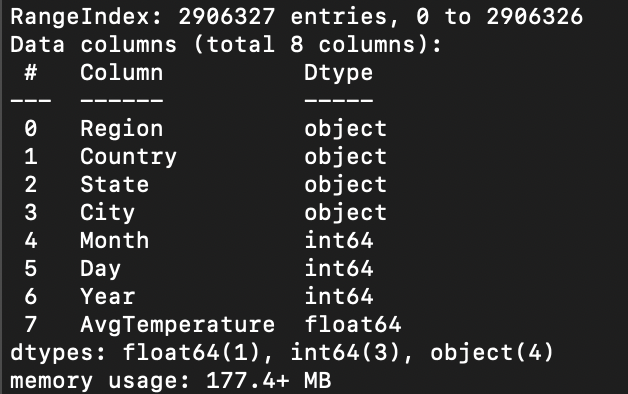
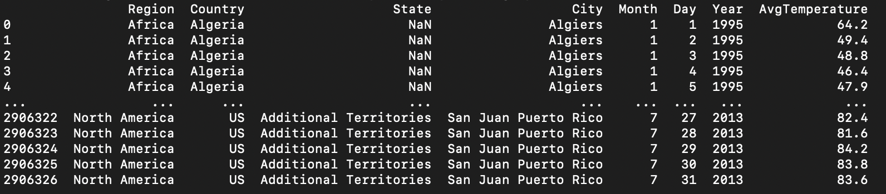
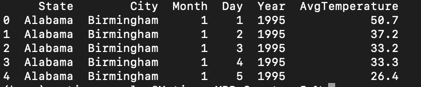
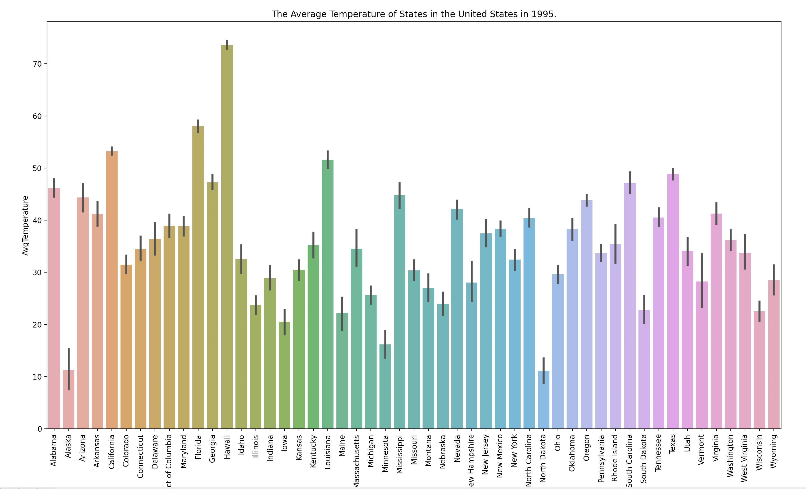
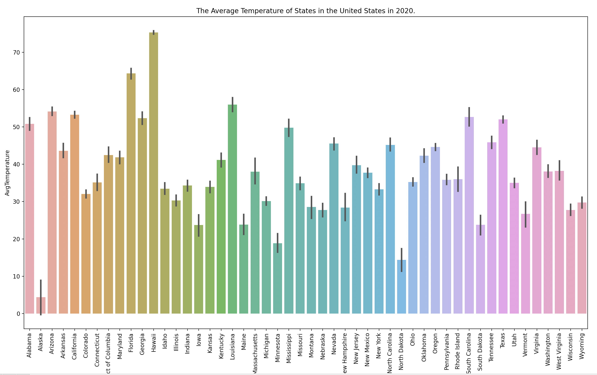
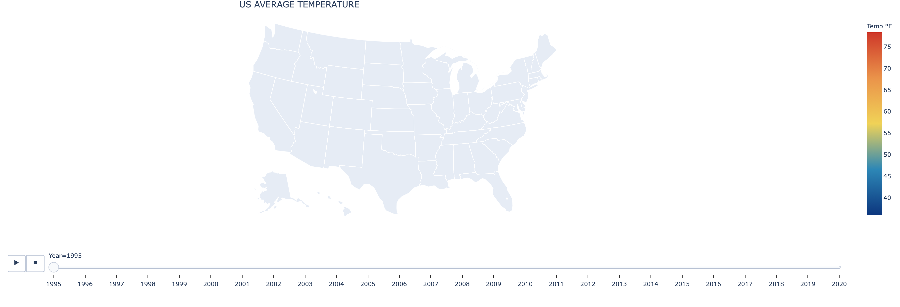
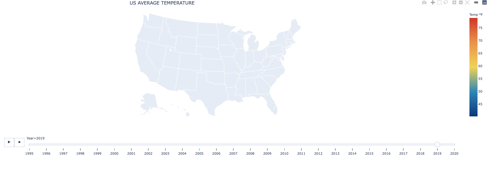

# Is Climate Change Real?

*Capstone I Project for Galvanize Data Science Immersive*

*by Matias Gonzalez*

## Table of Contents
- [Introduction](#introduction)
 - [Background](#background)
 - [The Data](#the-data)
 - [Question](#question)
 - [Hypothesis](#hypothesis)
- [Exploratory Data Analysis and Data Cleaning](#exploratory-data-analysis-and-Data-Cleaning)
- [Data Visulization](#Data-Visualization)
 - [Barplots](#barplots)
 - [Heat Map](#Heat_map)
- [T-Test](#T-Test)
 - [ANOVA (Analysis of Variance)](#ANOVA-(Analysis-of-Variance))
- [Conclusion](#Conclusion)

# Introduction

## Background
There are hundreds if not thousands of published studies proving climate change. Some use surface temperatures, others look at ozone layers, and some even look at sea levels to prove this theory. All of these technical studies prove climate change but it is hard to find one that is simple and straight to the point. 

The goal of this project is to demonstrate the changes in temperature over a period of time and determine with statistical certainty whether these values are significantly different. This project aims to provide a digestible way to look at climate change. 

## The Data
The University of Dayton published a CSV file in 2020 containing the average daily temperatures of over 320 cities from 1995 to 2020. The data set contains weather, more precisely, the average daily temperature in Fahrenheit, of 157 US cities and 167 international cities.

## Question
We are going to try to demonstrate the effect of climate change by showing the change in temperature over a period of time. We are going to statistically prove that this change has been significant, meaning it is not likely based on pure chance. We are going to cut down the data set to only include US cities to make our study more relatable.

Can we demonstrate that there has been a significant change in temperature over the years?
We are going to use an ANOVA (Analysis of Variance) T-Test to statistically prove the variance between different years.

##Hypothesis
We hypothesize that the means of temperature in the US from 1995 to 2019 is statistically different. We are going to use the p-value from our ANOVA T-test to prove this. The null hypothesis is that the values are not statistically different. Our threshold is going to be 0.05. 

[Back to Top](#Table-of-Contents)

# Exploratory Data Analysis and Data Cleaning
First, we get the general info and a look at the data.

We can see from this initial exploration that there are 8 columns to describe the data and we have around 3 million entries. Now let us take a peek at the actual data frame

Since we are only going to be working with US cities we want to exclude all non-US cities from our data. Since we were also able to see that some territories are included we will also be dropping those. We will also be dropping all values set to -99 since those are used as placeholders for invalid data.  

After we have filtered out our data for all unnecessary cities we take a look at the data again. We will extract our unique cities inside the data to inspect them. We are also going to take an overall look at these cities to make sure we have the correct data. 

After dropping some cities because they included incomplete data we can see we are working with 153 cities. We also had to drop the year 2020 from the study since it was incomplete. Further data cleaning was done with min and max to identify outliers and remove them. 

cities = ['Birmingham', 'Huntsville', 'Mobile', 'Montgomery', 'Anchorage',
    'Fairbanks', 'Juneau', 'Flagstaff', 'Phoenix', 'Tucson', 'Yuma',
    'Fort Smith', 'Little Rock', 'Fresno', 'Los Angeles', 'Sacramento',
    'San Diego', 'San Francisco', 'Colorado Springs', 'Denver',
    'Grand Junction', 'Pueblo', 'Bridgeport', 'Hartford Springfield',
    'Wilmington', 'Washington', 'Daytona Beach', 'Jacksonville',
    'Miami Beach', 'Orlando', 'Tallahassee', 'Tampa St. Petersburg',
    'West Palm Beach', 'Atlanta', 'Columbus', 'Macon', 'Savannah',
    'Honolulu', 'Boise', 'Pocatello', 'Chicago', 'Peoria', 'Rockford',
    'Springfield', 'Evansville', 'Fort Wayne', 'Indianapolis',
    'South Bend', 'Des Moines', 'Sioux City', 'Goodland', 'Topeka',
    'Wichita', 'Lexington', 'Louisville', 'Paducah', 'Baton Rouge',
    'Lake Charles', 'New Orleans', 'Shreveport', 'Caribou', 'Portland',
    'Baltimore', 'Washington DC', 'Boston', 'Detroit', 'Flint',
    'Grand Rapids', 'Lansing', 'Sault Ste Marie', 'Duluth',
    'Minneapolis St. Paul', 'Jackson', 'Tupelo', 'Kansas City',
    'St Louis', 'Billings', 'Great Falls', 'Helena', 'Lincoln',
    'North Platte', 'Omaha', 'Las Vegas', 'Reno', 'Concord',
    'Atlantic City', 'Newark', 'Albuquerque', 'Albany', 'Buffalo',
    'New York City', 'Rochester', 'Syracuse', 'Asheville', 'Charlotte',
    'Greensboro', 'Raleigh Durham', 'Bismarck', 'Fargo',
    'Akron Canton', 'Cincinnati', 'Cleveland', 'Dayton', 'Toledo',
    'Youngstown', 'Oklahoma City', 'Tulsa', 'Eugene', 'Medford',
    'Salem', 'Allentown', 'Erie', 'Harrisburg', 'Philadelphia',
    'Pittsburgh', 'Wilkes Barre', 'Rhode Island', 'Charleston',
    'Columbia', 'Rapid City', 'Sioux Falls', 'Chattanooga',
    'Knoxville', 'Memphis', 'Nashville', 'Abilene', 'Amarillo',
    'Austin', 'Brownsville', 'Corpus Christi', 'Dallas Ft Worth',
    'El Paso', 'Houston', 'Lubbock', 'Midland Odessa', 'San Angelo',
    'San Antonio', 'Waco', 'Wichita Falls', 'Salt Lake City',
    'Burlington', 'Norfolk', 'Richmond', 'Roanoke', 'Seattle',
    'Spokane', 'Yakima', 'Elkins', 'Green Bay', 'Madison', 'Milwaukee',
    'Casper', 'Cheyenne']

After confirming we have the right data selection and cleaned all of our data we can drop unnecessary columns. (Region and country) this is how the data frame we will be working with looks like. 

[Back to Top](#Table-of-Contents)

# Data Visualization

## Barplots

Barplots for 1995

Barplots for 2019

From a first impression, we can see that these values are different, with most of them being lower.  

## Heat map

Plotly decided it was not going to work so we have these incomplete heat maps. What we were trying to do here was show with colors the difference in temperature between years. We can still see that there has been a change in temperature since the scales are different. 

[Back to Top](#Table-of-Contents)

# T-Test
A T-test is a statistical test used to determine if there is a significant change in the mean in data. It is used as a hypothesis testing tool that allows testing of an assumption applicable to a population. A T-test is used to determine statistical significance. We are going to be using a T-test to demonstrate there has been a significant change in temperature over a period of time. There are many different types of T-Test. We are going to be concentrating on the ANOVA test

## ANOVA (Analysis of Variance)
The t-test and ANOVA produce a test statistic value (“t” or “F”, respectively), which is converted into a “p-value.” A p-value is a probability that the null hypothesis is true. In other words, a lower p-value reflects a value that is more significantly different across populations.

## Results and Interpretation
Our results when performing an ANOVA T-test are as follows. 

F_onewayResult(statistic=4.8186759678453335, pvalue=0.028155013645666947)

As we can see from our results our p-value is pretty low, it is 0.028. As stated above the smaller our p-value is the greater chance to prove our null hypothesis. In this case, since it is so low we will accept our hypothesis and we can safely say that there is a significant change in the values of our variables. 

[Back to Top](#Table-of-Contents)

# Conclusion
From our data exploration and statistical testing, we have proved our hypothesis and can reject our null. Our p-value was calculated at 0.028 which is lower than our threshold of 0.05. We set a pretty low threshold to prove our hypothesis without a doubt and that is what we have done. We have successfully demonstrated that there is a satistical significant difference in US major city temperatures from 1995 to 2019. 

[Back to Top](#Table-of-Con